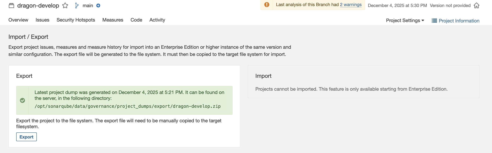

# SonarQube - Exporting & Viewing Results & understand technical debt for Dragon project

---

## 📥 Exporting Results

### Method 1: Web UI Export
1. Navigate to **Issues** page → Click **Export** → Choose **CSV/Excel**  
   URL: http://localhost:9000/project/issues?id=dragon-develop




### Method 2: API Export (JSON)

```bash
# Export all issues
curl -u admin:admin \
  "http://localhost:9000/api/issues/search?componentKeys=dragon-develop&ps=500" \
  -o sonarqube-issues.json
````

# Result example : 
```json
{
  "issues": [
    {
      "key": "AZrqF-6pe1qfT7iESEaE",
      "rule": "python:S1192",
      "severity": "CRITICAL",
      "component": "dragon-develop:backend/tests/test_document_service_unit.py",
      "line": 130,
      "message": "Define a constant instead of duplicating this literal \"text/plain\"",
      "debt": "14min",
      "status": "OPEN"
    }
  ]
}
```
# Export project metrics
curl -u admin:admin \
  "http://localhost:9000/api/measures/component?component=dragon-develop&metricKeys=bugs,vulnerabilities,code_smells,sqale_index,coverage,duplicated_lines_density" \
  -o sonarqube-metrics.json

# Export security hotspots
curl -u admin:admin \
  "http://localhost:9000/api/hotspots/search?projectKey=dragon-develop" \
  -o sonarqube-hotspots.json

# SonarQube - Reading Results & Understanding Technical Debt

---

## 📖 Dashboard Overview

| Aspect        | Description                             | Key Metrics                         |
|---------------|-----------------------------------------|-------------------------------------|
| Code Quality  | Bugs, anti-patterns, code complexity    | Bugs, Cognitive Complexity          |
| Technical Debt| Time to fix maintainability issues      | Debt Ratio, Code Smells             |
| SAST Security | Security vulnerabilities in source code | Vulnerabilities, Security Hotspots  |
| Coverage      | Test coverage (if configured)           | Line Coverage, Branch Coverage      |

---

## Priority Actions

1. **Blocker/Critical Bugs** → Fix immediately  
2. **Blocker/Critical Vulnerabilities** → Security patch ASAP  
3. **Security Hotspots** → Manual review  
4. **Major Code Smells** → Plan refactoring  
5. **Technical Debt** → Track trend, reduce over time

---

## Understanding Technical Debt

SonarQube estimates **Technical Debt** to help teams understand the effort required to fix maintainability issues in a project. It provides a **relative estimate** rather than actual development time.

### How Debt is Calculated

- **Per Issue Basis:** Each code smell or maintainability issue is assigned a **default remediation time** based on its type and severity.  
  Example defaults:
  | Issue Type         | Severity  | Remediation Time |
  |--------------------|-----------|------------------|
  | Duplicated String  | CRITICAL  | 2–14 min         |
  | Long Method        | MAJOR     | 30 min           |
  | Complex Conditional| MINOR     | 10 min           |

- **Total Debt:** SonarQube sums the remediation time of all issues:

  Total Technical Debt = Sum(Remediation Time of each issue)

- **Debt Ratio:** Shows how much effort is required to fix issues compared to the estimated project development time:
  
  Debt Ratio = Total Technical Debt / Estimated Development Time

  Target: <5%

- **SQALE Rating:** A–E rating based on debt ratio:
| Debt Ratio | Rating |
|------------|--------|
| 0–5%       | A      |
| 5–10%      | B      |
| 10–20%     | C      |
| 20–50%     | D      |
| >50%       | E      |

### Example

```json
{
"issues": [
  { "message": "Duplicated string", "debt": "14min" },
  { "message": "Long method", "debt": "30min" }
],
"totalDebt": "44min",
"estimatedDevTime": "220min",
"debtRatio": 0.2
}
```

### Interpretation:

Total debt = 44 min

Debt ratio = 44 ÷ 220 = 0.2 (20%)

SQALE Rating = D → high technical debt, refactoring recommended