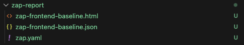
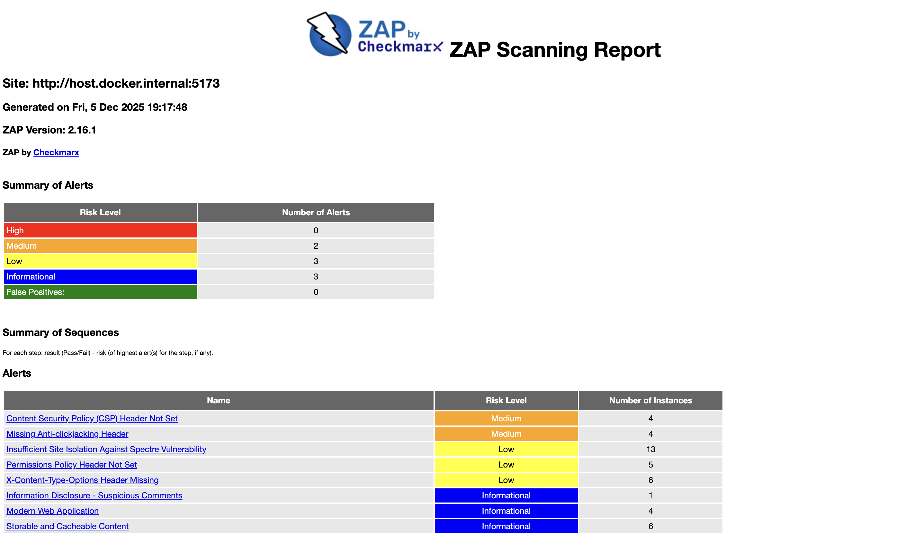

# OWASP ZAP (DAST Web) Scan - Dragon App Example
OWASP ZAP (DAST) is a *dynamic security scanner* that tests a **running web application** for vulnerabilities such as missing security headers, XSS entry points, insecure cookies, weak CSP, server misconfigurations, and more.  
It simulates an attacker’s behavior against your application while it is running.


---

## 🚀 Quick Scan Procedure

### 1. Clone repository and checkout branch
```bash
git clone https://github.com/keiken-digital-solution/keiken-dragon-ai.git
cd keiken-dragon-ai  && git checkout develop
```

---

## 2. Prepare a folder for ZAP reports

```bash
mkdir -p zap-report
```

This folder will store the generated **HTML** and **JSON** reports.

---

## 3. Run OWASP ZAP Baseline Scan with Docker

```bash
docker run --rm \
  -v "$(pwd)/zap-report:/zap/wrk" \
  ghcr.io/zaproxy/zaproxy:stable \
  zap-baseline.py -t http://host.docker.internal:5173 \
  -J zap-frontend-baseline.json \
  -r zap-frontend-baseline.html
```

**Explanation:**

* `-v "$(pwd)/zap-report:/zap/wrk"` → maps the local `zap-report` folder to ZAP’s working directory.
* `-t` → target URL of your app.
* `-J` → JSON report output filename.
* `-r` → HTML report output filename.


---

## 4. Retrieve and read the reports

After the scan completes, the reports will be in your local folder:

```bash
ls zap-report/
```

Example output:

```
zap-frontend-baseline.html
zap-frontend-baseline.json
```

 

* Open the HTML report in a browser to see detailed scan results.
* The JSON report can be parsed or integrated into CI/CD pipelines.

---

## 5. Sample results (Dragon app)

**HTML report:**

* Displays PASS, WARN, and FAIL for various security checks.
* Shows vulnerable JS libraries, missing headers, and potential XSS issues.

 
**JSON report:**

* Structured data for automation.
* Can be used to extract specific alerts programmatically.

### JSON Report Sample
```json
{
	"@programName": "ZAP",
	"@version": "2.16.1",
	"@generated": "Fri, 5 Dec 2025 19:31:07",
	"created": "2025-12-05T19:31:07.193752338Z",
	"site":[ 
		{
			"@name": "http://host.docker.internal:5173",
			"@host": "host.docker.internal",
			"@port": "5173",
			"@ssl": "false",
			"alerts": [ 
				{
					"pluginid": "10038",
					"alertRef": "10038-1",
					"alert": "Content Security Policy (CSP) Header Not Set",
					"name": "Content Security Policy (CSP) Header Not Set",
					"riskcode": "2",
					"confidence": "3",
					"riskdesc": "Medium (High)",
					"desc": "Content Security Policy (CSP) is an added layer of security ...",
					"instances":[ 
						{"id": "8","uri": "http://host.docker.internal:5173","method": "GET"}
					],
					"count": "4",
					"solution": "Ensure that your web server ... is configured to set the Content-Security-Policy header.",
					"reference": "https://developer.mozilla.org/en-US/docs/Web/HTTP/Guides/CSP"
				},
				{
					"pluginid": "10020",
					"alertRef": "10020-1",
					"alert": "Missing Anti-clickjacking Header",
					"name": "Missing Anti-clickjacking Header",
					"riskcode": "2",
					"confidence": "2",
					"riskdesc": "Medium (Medium)",
					"desc": "The response does not protect against 'ClickJacking' attacks ...",
					"instances":[ 
						{"id": "4","uri": "http://host.docker.internal:5173","method": "GET"}
					],
					"count": "4",
					"solution": "Modern Web browsers support the Content-Security-Policy ...",
					"reference": "https://developer.mozilla.org/en-US/docs/Web/HTTP/Reference/Headers/X-Frame-Options"
				}
			]
		}
	]
}
```

---


