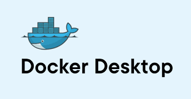
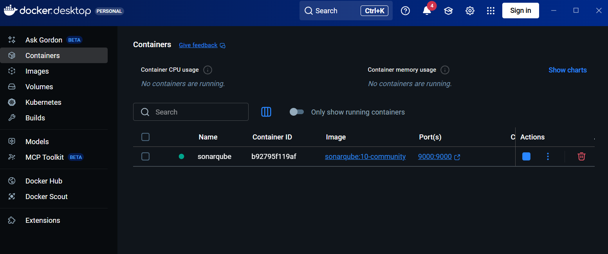
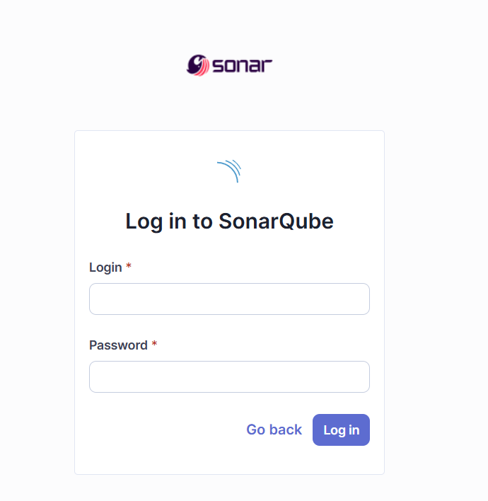
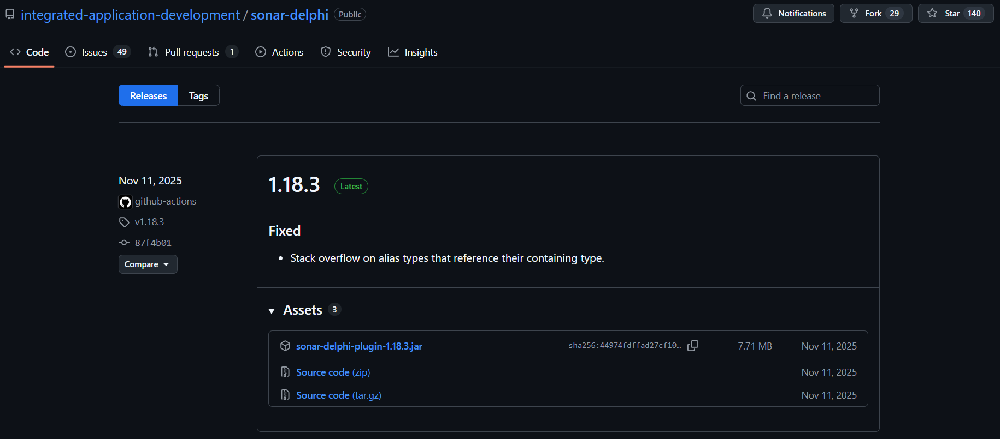
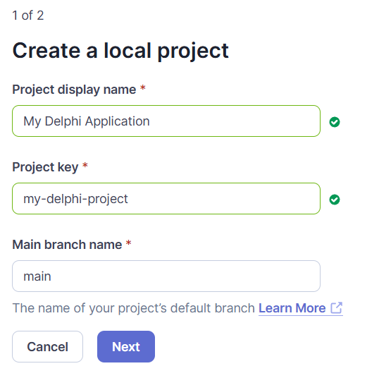
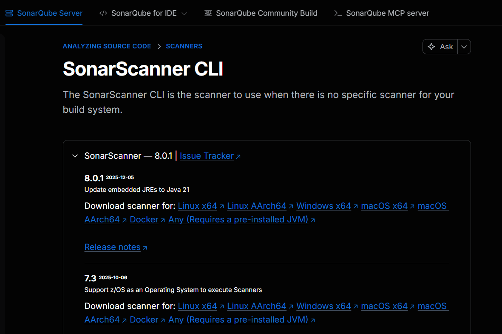
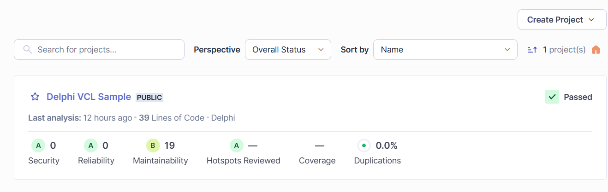
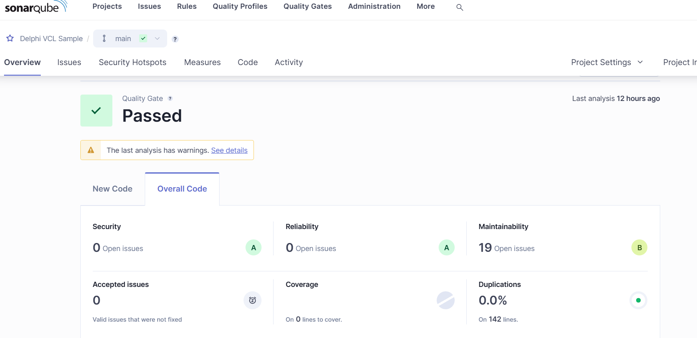

# SonarQube Delphi Scan – Complete Step-by-Step Guide

**Last Updated: January 2026**

## This guide walks you through every step required to set up and run **SonarQube static code analysis on Delphi applications** using a local Docker-based setup.

## Prerequisites Overview

Before starting, ensure you have:

- Windows 10/11 (64-bit) with administrator rights

---

# PART 1: ENVIRONMENT SETUP

---

## Step 1: Install Java JDK 21

### What You Need

Java JDK 21 is the minimum required version for SonarQube and its scanners.

## Step 2: Install RAD Studio (Delphi)

### What You Need

RAD Studio is required to verify and work with your Delphi source code.

### Install RAD Studio\*\*

- Install **RAD Studio 12 Athens** Community Edition

> 📸 **Screenshot 1**: 

---

## Step 3: Install Docker Desktop

### What You Need

Docker Desktop runs SonarQube in a container on your local machine.

### Download Docker Desktop for Windows

> 📸 **Screenshot 2**: 

---

# PART 2: SONARQUBE SERVER SETUP

---

## Step 4: Deploy SonarQube Container

### What You're Doing

Running SonarQube as a Docker container on your local machine.

### Deployment Steps

1. **Open Command Prompt or PowerShell**

2. **Pull and Run SonarQube**

   ```bash
   docker run -d --name sonarqube -p 9000:9000 sonarqube:10-community
   ```

   **Command Breakdown:**

   - `docker run` = Create and start a container
   - `-d` = Run in background (detached mode)
   - `--name sonarqube` = Name the container "sonarqube"
   - `-p 9000:9000` = Map port 9000 (host:container)
   - `sonarqube:10-community` = Image to use

3. **Verify Container is Running**
   - In Docker Desktop, go to "Containers" tab
   - You should see "sonarqube" with status "Running"

> 📸 **Screenshot 3**: 

---

## Step 5: Access SonarQube Web Interface

### Initial Access Steps

1. **Open Your Web Browser**
   - Navigate to: `http://localhost:9000`
   - Wait for SonarQube UI to load (may take a few seconds)

> 📸 **Screenshot 5.1**: 

2. **Log In with Default Credentials**

   - Username: `admin`
   - Password: `admin`
   - Click "Log in"

3. **Change Default Password (Required)**
   - SonarQube will prompt you to change the password
   - Enter a new password
   - Confirm and save

---

## Step 6: Install Delphi Plugin

### What You're Doing

Adding Delphi language support to SonarQube by installing a plugin inside the container.

### Important Note

⚠️ The plugin is NOT installed in RAD Studio. It's installed in the SonarQube server.

### Installation Steps

1. **Download the Delphi Plugin**
   - Visit: https://github.com/integrated-application-development/sonar-delphi/releases
   - Download the latest `.jar` file (e.g., `sonar-delphi-plugin-1.18.1.jar`)

> 📸 **Screenshot 6.1**: 

2. **Copy Plugin to Docker Container**

   - Open Command Prompt
   - Navigate to your download location:
     ```bash
     cd C:\Downloads
     ```
   - Copy the plugin into the container:
     ```bash
        docker cp sonar-delphi-plugin-1.18.3.jar sonarqube:/opt/sonarqube/extensions/plugins/
     ```

3. **Restart SonarQube Container**

   - In Command Prompt, type:
     ```bash
     docker restart sonarqube
     ```
   - Wait 2-3 minutes for SonarQube to restart

4. **Verify Plugin Installation**
   - Refresh browser at `http://localhost:9000`
   - Log in again (admin + your new password)
   - Go to: **Administration** → **Marketplace** → **Installed**
   - Look for "Delphi" in the list

> 📸 **Screenshot 6.7**: 

---

# PART 3: PROJECT CONFIGURATION

---

## Step 7: Create a SonarQube Project

### What You're Doing

Setting up a project in SonarQube to receive and store analysis results.

### Project Creation Steps

1. **Navigate to Projects**

   - Click on "Projects" in the top menu
   - Click "Create Project" button (or "Analyze a new project")

2. **Choose Manual Setup**

   - Select "Manually"

3. **Enter Project Details**
   - **Project display name:** `My Delphi Application`
   - **Project key:** `my-delphi-project`
   - **Main branch name:** `main` (or `master`)
   - Click "Set Up"

> 📸 **Screenshot 7.3**: 

---

## Step 8: Generate Authentication Token

### What You're Doing

Creating a secure token that allows the scanner to send results to SonarQube.

### Token Generation Steps

1. **Configure Token**
   - Under Account > My Account > Security, you'll see token generation options
   - **Type:** Select "User Token"
   - **Token name:** `delphi-scanner-token`
   - **Expires in:** Select duration (e.g., "30 days" or "No expiration")
   - Click "Generate"

> 📸 **Screenshot 8.1**: 

3. **Copy and Save Token**
   - A token will be generated (starts with `sqp_`)
   - **IMPORTANT:** Copy this token immediately
   - Store it securely (you won't be able to see it again)
   - Example: `sqp_1234567890abcdefghijklmnopqrstuv`

---

## Step 9: Install SonarScanner CLI

### What You're Doing

Installing the command-line tool that will scan your Delphi code.

### Installation Steps

1. **Download SonarScanner**
   - Click the download link from Step 9, or visit:
     https://docs.sonarsource.com/sonarqube-server/analyzing-source-code/scanners/sonarscanner
   - Download "SonarScanner for Windows"

> 📸 **Screenshot 10.1**: 

2. **Extract the Archive**

   - Extract the ZIP file to `C:\sonar-scanner`
   - The folder should contain: `bin`, `conf`, `lib` folders

3. **Add to System PATH (Optional but Recommended)**

   - Go to "Environment Variables"
   - Under "System variables", select "Path" → Edit
   - Click "New"
   - Add: `C:\sonar-scanner\bin`
   - Click OK on all windows

4. **Verify Installation**
   - Open a NEW Command Prompt (to reload PATH)
   - Type: `sonar-scanner -v`
   - Expected output: `SonarScanner 6.x.x`

---

# PART 4: SOURCE CODE PREPARATION

---

## Step 11: Prepare Your Delphi Project

### What You're Doing

Organizing your Delphi source code for analysis.

### Preparation Steps

1. **Verify Project Opens in RAD Studio**
   - Open your `.dpr` or `.dproj` file in RAD Studio
   - Ensure it compiles without errors
   - Close RAD Studio before scanning

---

## Step 12: Create Configuration File

### What You're Doing

Creating a `sonar-project.properties` file that tells the scanner what to analyze.

### Configuration Steps

1. **Create the Properties File**

   - Navigate to your project root (e.g., `C:\Projects\MyDelphiApp\`)
   - Create a new file named: `sonar-project.properties`
   - Use Notepad or any text editor

2. **Add Required Properties**

   Copy and paste the following template:

   ```properties
   # Project identification
   sonar.projectKey=my-delphi-project
   sonar.projectName=My Delphi Application
   sonar.projectVersion=1.0.0

   # Source code location
   sonar.sources=.
   # Encoding
   sonar.sourceEncoding=UTF-8

    sonar.inclusions=**/*.pas,**/*.dpr,**/*.dfm

    # Your Delphi installation path
    sonar.delphi.installationPath=C:/Program Files (x86)/Embarcadero/Studio/23.0
   ```

3. **Customize the Properties**
   - Replace `my-delphi-project` with your project key from Step 7
   - Replace `My Delphi Application` with your project name
   - Update `sonar.sources` to point to your source directories
   - Update `sonar.delphi.installationPath` to point to your Delphi instaltion directories

# PART 5: RUNNING THE ANALYSIS

---

## Step 14: Execute the Scan

### What You're Doing

Running the SonarScanner to analyze your Delphi code and send results to SonarQube.

### Execution Steps

1. **Open Command Prompt**

   - Press Win+R, type `cmd`, press Enter

2. **Navigate to Your Project Directory**

   ```bash
   cd C:\Projects\MyDelphiApp
   ```

3. **Run the Scanner**

   ```bash
   sonar-scanner -D"sonar.host.url=http://localhost:9000" -D"sonar.token=squ_cd95dbff73706afe4e52e4c5c0ca13a05d3f2b21" -X
   ```

   3. **Customize the Properties**

   - Replace `squ_cd95dbff73706afe4e52e4c5c0ca13a05d3f2b21` with your token generated

4. **Monitor the Scan Progress**

   You'll see output like:

   ```
   INFO: Scanner configuration file: C:\sonar-scanner\conf\sonar-scanner.properties
   INFO: Project root configuration file: C:\Projects\MyDelphiApp\sonar-project.properties
   INFO: SonarScanner 6.2.0.4584
   INFO: Java 21.0.1 Oracle Corporation
   INFO: Windows 11 10.0 amd64
   INFO: Analyzing on SonarQube Server 2025.4
   INFO: Load global settings
   INFO: Load project settings
   INFO: Loading quality profiles
   INFO: Load quality profiles (done) | time=234ms
   INFO: Load active rules
   INFO: Load active rules (done) | time=1456ms
   INFO: Indexing files...
   INFO: 150 files indexed
   INFO: Analyzing 150 files...
   INFO: Sensor Delphi Sensor [communitydelphi]
   INFO: Analyzing Delphi source files...
   INFO: 120/150 source files have been analyzed
   ```

5. **Wait for Completion**

   Final output will show:

   ```
   INFO: Analysis total time: 45.234 s
   INFO: ANALYSIS SUCCESSFUL
   INFO: Note that you will be able to access the updated dashboard once the server has processed the submitted analysis report
   INFO: More about the report processing at http://localhost:9000/api/ce/task?id=AY_abc123xyz
   INFO: Task total time: 45.567 s
   INFO: SUCCESS
   INFO: View the results at: http://localhost:9000/dashboard?id=my-delphi-project
   ```

---

# PART 6: VIEWING AND INTERPRETING RESULTS

---

## Step 15: Access Your Project Dashboard

### What You're Doing

Viewing the analysis results in the SonarQube web interface.

### Dashboard Access Steps

1. **Open the Results Link**
   - Copy the URL from the scan output
   - Or go to: `http://localhost:9000`
   - Click on your project: "My Delphi Application"

> 📸 **Screenshot 15.1**: 

2. **View Project Overview**

   The overview page shows:

   - **Quality Gate Status** (Passed/Failed)
   - **New Code metrics** (issues found in recent changes)
   - **Overall Code metrics**

> 📸 **Screenshot 15.2**: 

