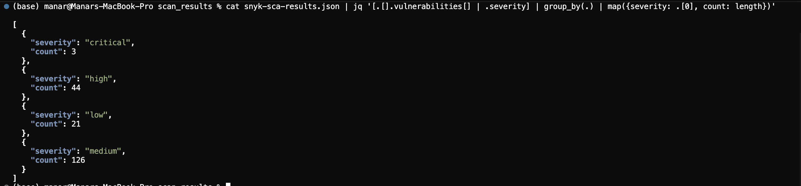
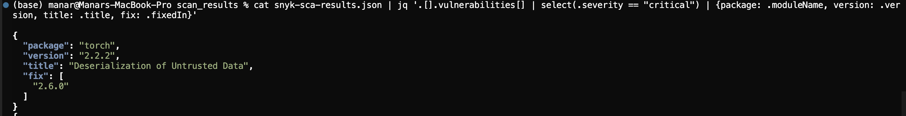
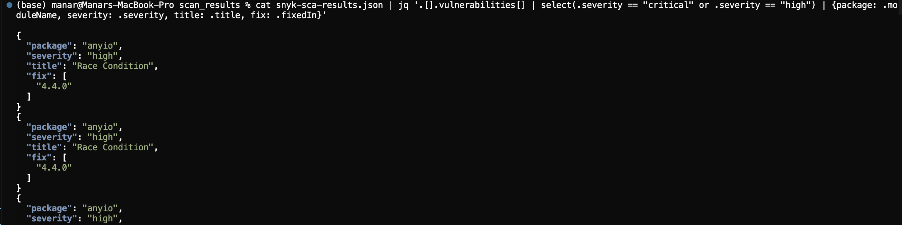
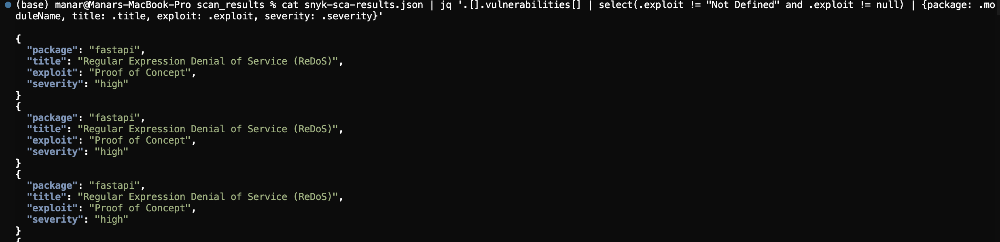
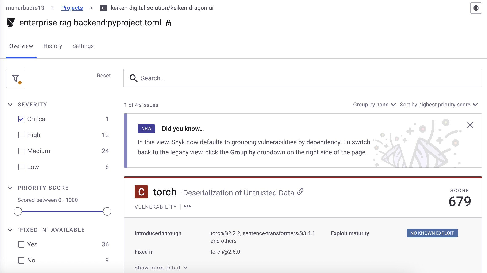

# Snyk - Results Exploitation

---

## 📖 How to Read Snyk Results

After running Snyk scans, you'll have JSON files in `Scanner/Snyk/scan_results/`. Here's how to understand them:

### Quick Overview

```bash
cd Scanner/Snyk/scan_results/

# Check file sizes (0B = failed scan)
ls -lh

# View file structure
head -100 snyk-sca-results.json | jq '.'
```

### Understanding Severity Levels

| Severity | Color | Priority | Action Timeline |
|----------|-------|----------|----------------|
| **Critical** | 🔴 Red | P0 | Immediate (within 24h) |
| **High** | 🟠 Orange | P1 | Urgent (within 1 week) |
| **Medium** | 🟡 Yellow | P2 | Schedule (within 1 month) |
| **Low** | 🟢 Green | P3 | Monitor |

### Key Metrics to Check First

```bash
# 1. Count total vulnerabilities by severity (SCA)
cat snyk-sca-results.json | jq '[.[].vulnerabilities[] | .severity] | group_by(.) | map({severity: .[0], count: length})'

# 2. Count code issues by level (SAST)
cat snyk-sast-results.json | jq '[.runs[].results[] | .level] | group_by(.) | map({level: .[0], count: length})'

# 3. Container vulnerabilities (Frontend example)
cat snyk-container-frontend-results.json | jq '{critical: [.vulnerabilities[] | select(.severity == "critical")] | length, high: [.vulnerabilities[] | select(.severity == "high")] | length}'
```

### Reading the Results: What to Look For

#### 🔍 For SCA (Dependencies):
1. **Total vulnerability count** - How many issues exist?
2. **Critical/High count** - What needs immediate attention?
3. **Fix availability** - Are patches available (`fixedIn` field)?
4. **Exploit status** - Is there a known exploit in the wild?

#### 🔍 For SAST (Code):
1. **Error level issues** - Security vulnerabilities in your code
2. **File locations** - Which files have the most issues?
3. **CWE references** - Type of vulnerability (SQL Injection, XSS, etc.)
4. **Line numbers** - Exact location to fix

#### 🔍 For Container (Docker):
1. **Base image recommendations** - Is there a safer base image?
2. **OS package vulnerabilities** - Outdated system packages
3. **Severity distribution** - How exposed is your container?

### Example: Reading a Real Vulnerability

```json
{
  "id": "SNYK-PYTHON-TORCH-12345",
  "title": "Deserialization of Untrusted Data",
  "severity": "critical",
  "cvssScore": 8.5,
  "moduleName": "torch",
  "version": "2.2.2",
  "fixedIn": ["2.6.0"],
  "exploit": "No Known Exploit"
}
```

**What this tells you:**
- 🔴 **Critical** severity - Fix immediately
- 📦 Package `torch` version `2.2.2` is vulnerable
- ✅ Fix available: upgrade to version `2.6.0`
- ⚠️ No known exploit yet (but could appear anytime)
- 🎯 **Action**: Run `pip install torch==2.6.0`


---

## 1. Example Exploiting SCA Results (Dependencies)

### File: `snyk-sca-results.json`

This file contains all vulnerabilities found in project dependencies (Python, npm, etc.).

### File Structure

```json
{
  "vulnerabilities": [
    {
      "id": "SNYK-PYTHON-REQUESTS-12345",
      "title": "Prototype Pollution",
      "severity": "high",
      "packageName": "requests",
      "version": "2.25.0",
      "fixedIn": ["2.31.0"],
      "cvssScore": 7.4,
      "exploit": "Proof of Concept",
      "isPatchable": true,
      "upgradePath": ["requests@2.31.0"]
    }
  ],
  "summary": {
    "critical": 2,
    "high": 15,
    "medium": 45,
    "low": 12
  }
}
```

### Analysis Commands

```bash
cd Scanner/Snyk/scan_results/
```

# 1. Count vulnerabilities by severity
```bash
cat snyk-sca-results.json | jq '[.[].vulnerabilities[] | .severity] | group_by(.) | map({severity: .[0], count: length})'
```


# 2. List all critical vulnerabilities
```bash
cat snyk-sca-results.json | jq '.[].vulnerabilities[] | select(.severity == "critical") | {package: .moduleName, version: .version, title: .title, fix: .fixedIn}'
```



# 3. List high and critical vulnerabilities
```bash
cat snyk-sca-results.json | jq '.[].vulnerabilities[] | select(.severity == "critical" or .severity == "high") | {package: .moduleName, severity: .severity, title: .title, fix: .fixedIn}'
```



# 4. Vulnerabilities with known exploit (high priority)
```bash
cat snyk-sca-results.json | jq '.[].vulnerabilities[] | select(.exploit != "Not Defined" and .exploit != null) | {package: .moduleName, title: .title, exploit: .exploit, severity: .severity}'
```


### SCA Prioritization

| Priority | Criteria | Action |
|----------|----------|--------|
| 🔴 **CRITICAL** | Severity: Critical + Known exploit | Immediate fix |
| 🟠 **HIGH** | Severity: High + Patchable | Fix within 48h |
| 🟡 **MEDIUM** | Severity: Medium + Patchable | Schedule fix |
| 🟢 **LOW** | Severity: Low | Monitor |

---

## 2. Generating Consolidated Reports

### Create Excel/CSV Report

```bash
# Export CSV of critical/high vulnerabilities
cat snyk-sca-results.json | jq -r '.[].vulnerabilities[] | select(.severity == "critical" or .severity == "high") | [.moduleName, .version, .severity, .title, .fixedIn[0]] | @csv' > vulnerabilities-high-critical.csv

# Open in Excel or Google Sheets
open vulnerabilities-high-critical.csv
```

### Summary Dashboard

```bash
# Create global summary
echo "=== Snyk Security Scan Results ===" > security-summary.txt
echo "" >> security-summary.txt
echo "SCA (Dependencies):" >> security-summary.txt
cat snyk-sca-results.json | jq '[.[].vulnerabilities[] | .severity] | group_by(.) | map({severity: .[0], count: length})' >> security-summary.txt
echo "" >> security-summary.txt
echo "SAST (Code Analysis):" >> security-summary.txt
cat snyk-sast-results.json | jq '[.runs[].results[] | .level] | group_by(.) | map({level: .[0], count: length})' >> security-summary.txt
echo "" >> security-summary.txt
cat security-summary.txt
```

---

## 3. Action Plan Template

After analyzing results, follow this plan:

### 1: Emergencies

- [ ] Fix all **Critical** vulnerabilities with known exploits (SCA)
- [ ] Fix all **error level** SAST vulnerabilities (SQL Injection, XSS)
- [ ] Upgrade Docker base images if recommended

### 2: Priority Fixes

- [ ] Fix **High** patchable vulnerabilities (SCA)
- [ ] Fix critical **warning level** SAST issues
- [ ] Rebuild Docker images with OS updates

### 3: Continuous Improvement

- [ ] Schedule **Medium** severity fixes
- [ ] Set up continuous monitoring (`snyk monitor`)
- [ ] Integrate Snyk into CI/CD pipeline
- [ ] Train team on identified best practices

---

## 6. Continuous Monitoring

### Send Results to Snyk Dashboard

```bash
cd keiken-dragon-ai
snyk monitor --all-projects --project-name="dragon-develop"
```

Access dashboard: https://app.snyk.io/



### Configure Alerts

1. Go to https://app.snyk.io/org/YOUR_ORG/manage/settings
2. Configure:
   - Email alerts for new critical vulnerabilities
   - Webhooks for Slack/Teams integration
   - Weekly security reports

---