# 📝 Hands-On: SonarQube Analysis on a React TypeScript App


---

## 1️⃣ Start SonarQube server

```bash
docker run -d --name sonarqube -p 9000:9000 sonarqube
```

* Admin credentials for SonarQube:

  * Username: `admin`
  * Password: `admin`

> **Screenshot Placeholder:** 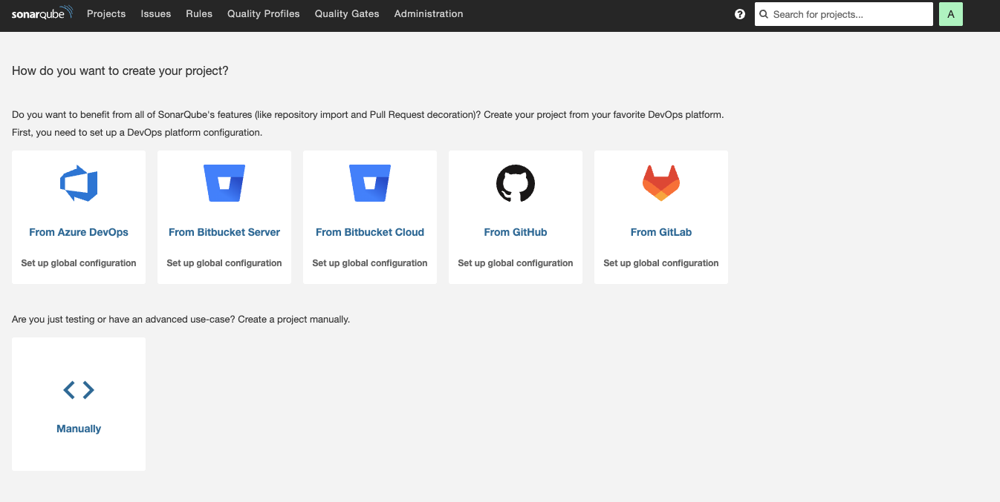

---

## 2️⃣ Create a New React TypeScript App

```bash
npx create-react-app hello-world-react --template typescript
cd hello-world-react
```

> **Screenshot Placeholder:** 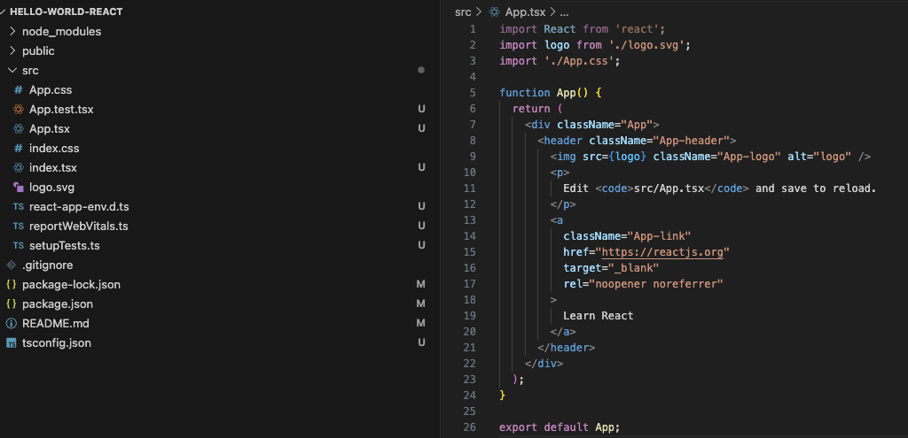

---

## 3️⃣ Add Unit Tests and Generate Coverage

Install Jest (already included with CRA):

```bash
npm install --save-dev jest
```

Run tests with coverage:

```bash
npm test -- --coverage
```

This generates a **coverage report** at:

```
coverage/lcov.info
```

> **Screenshot Placeholder:** 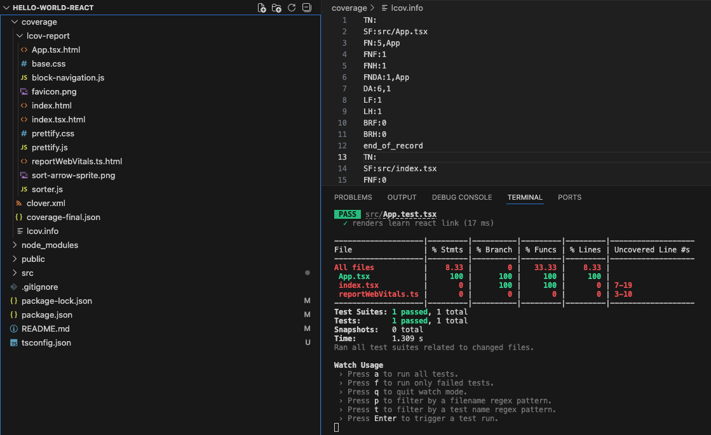

---
## 4️⃣ Run Initial SonarQube Scan

There are **two ways** to run a scan:

### **Option 1: Command-Line Parameters**

```bash
docker run --rm -v "$(pwd):/usr/src" sonarsource/sonar-scanner-cli \
  -Dsonar.projectKey=hello-world-react \
  -Dsonar.projectName="Hello World React" \
  -Dsonar.sources=src \
  -Dsonar.host.url=http://localhost:9000 \
  -Dsonar.login=admin \
  -Dsonar.password=admin \
  -Dsonar.typescript.lcov.reportPaths=coverage/lcov.info
```

### **Option 2: Using `sonar-project.properties`**

Create a file `sonar-project.properties`:

```properties
# Unique key for the project in SonarQube
sonar.projectKey=hello-world-react

# Human-readable project name displayed in SonarQube
sonar.projectName=Hello World React

# Directory containing the source code to be analyzed
sonar.sources=src

# URL of the SonarQube server
sonar.host.url=http://localhost:9000

# Login token or username for SonarQube authentication
sonar.login=admin

# Password for SonarQube authentication
sonar.password=admin

# Path to the TypeScript code coverage report generated by your tests
sonar.typescript.lcov.reportPaths=coverage/lcov.info
```

> **Screenshot Placeholder:** 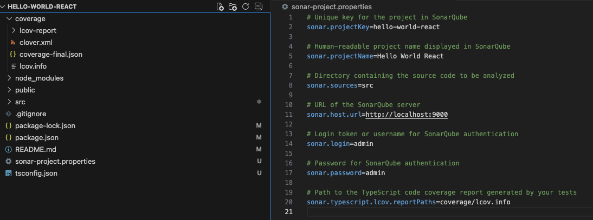

Then run:

```bash
docker run --rm --network host -v "$(pwd):/usr/src" sonarsource/sonar-scanner-cli
```

> **Screenshot Placeholder:** 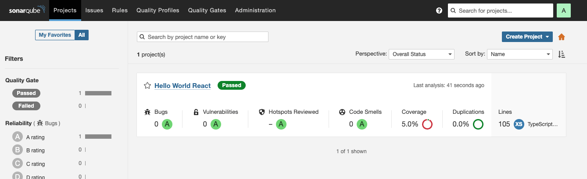

---

---
## 5️⃣ Create a Custom Quality Profile in SonarQube

1. Go to **SonarQube Dashboard → Quality Profiles**.
> **Screenshot Placeholder:** 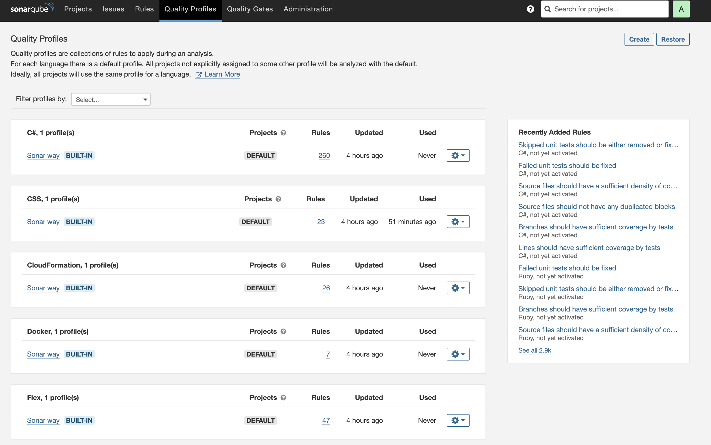
2. Click **Create → TypeScript**.
3. Choose a **parent profile**: `Sonar way`.
4. Enter a name for your profile (e.g., `Custom React TS Profile`).
> **Screenshot Placeholder:** 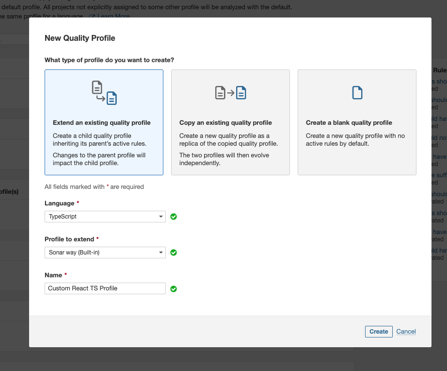
5. Click **Create**.
6. Enable/disable rules based on your coding standards. 
    Example:
    **Screenshot Placeholder:** 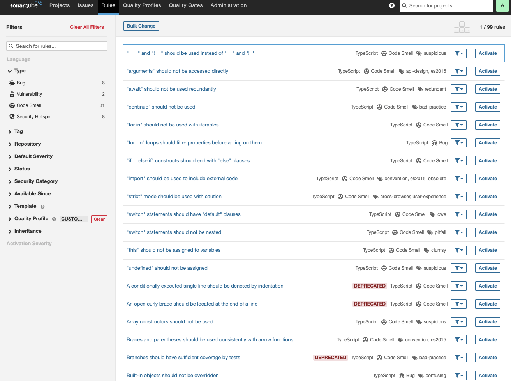
    * Enable: `"==" and "!=" should be replaced with "===" and "!=="`
        >When activating a rule, specify the Quality Profile (Custom React TS Profile) and set the Severity level (e.g., Major, Critical).
        **Screenshot Placeholder:** 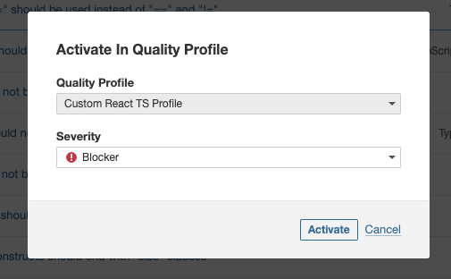
    * Disable: rules you consider too strict for your team
7. Save your profile.

> **Screenshot Placeholder:** 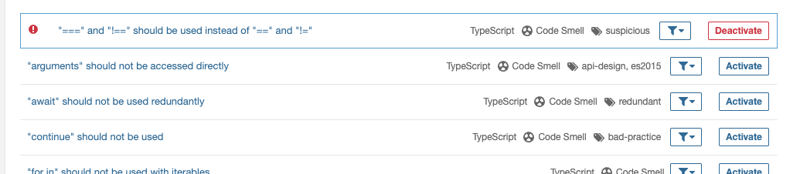

---

## 6️⃣  Assign the Quality Profile to Your Project

> **Screenshot Placeholder:** 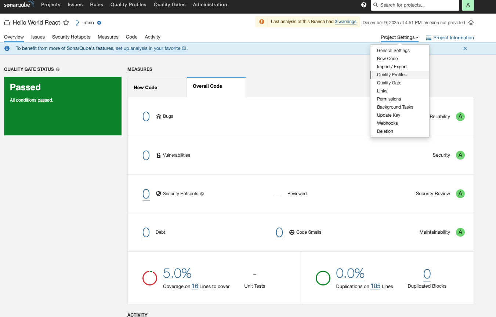
1. Go to **SonarQube Dashboard → Projects → hello-world-react → Administration → Quality Profiles**.
> **Screenshot Placeholder:** 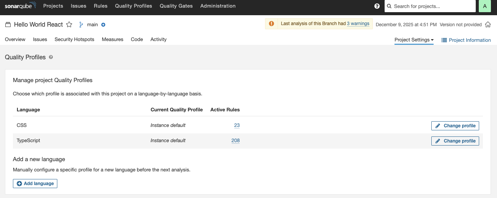
2. Select your newly created profile `Custom React TS Profile` for TypeScript.
> **Screenshot Placeholder:** 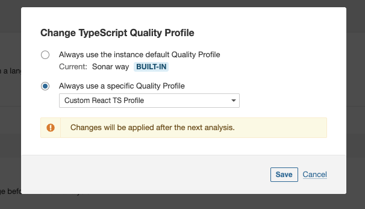
3. Save the changes.

> **Screenshot Placeholder:** 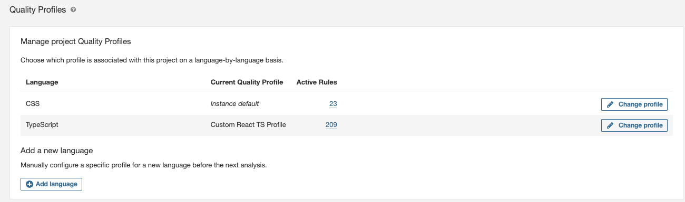

---

## 7️⃣ Add Sample Code to Test Rules

In `src/App.tsx` add:

```ts
const a = 5;
const b = '5';

if (a == b) {
  console.log("This should trigger a SonarQube issue!");
}

if (a != b) {
  console.log("This should also trigger a SonarQube issue!");
}
```

> **Screenshot Placeholder:** 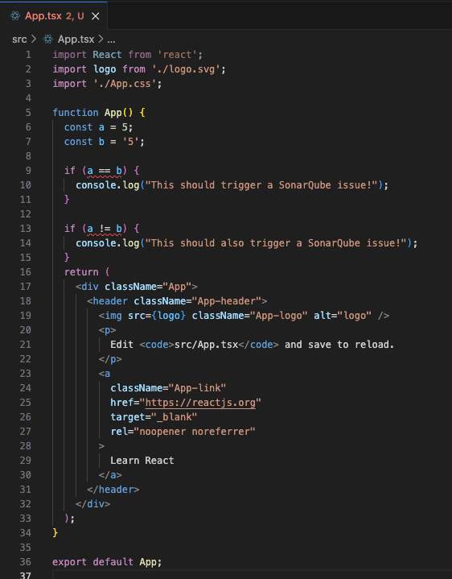

---

## 8️⃣ ReRun SonarQube Scan

```bash
docker run --rm --network host -v "$(pwd):/usr/src" sonarsource/sonar-scanner-cli
```

> **Screenshot Placeholder:** 

---

## 9️⃣ Verify Scan Results

1. Open SonarQube dashboard → **hello-world-react project**.
2. Check **Issues** tab for violations.
3. You should see issues for `"=="` and `"!="`:

```
Replace "==" with "===" and "!=" with "!=="
```

> **Screenshot Placeholder:** 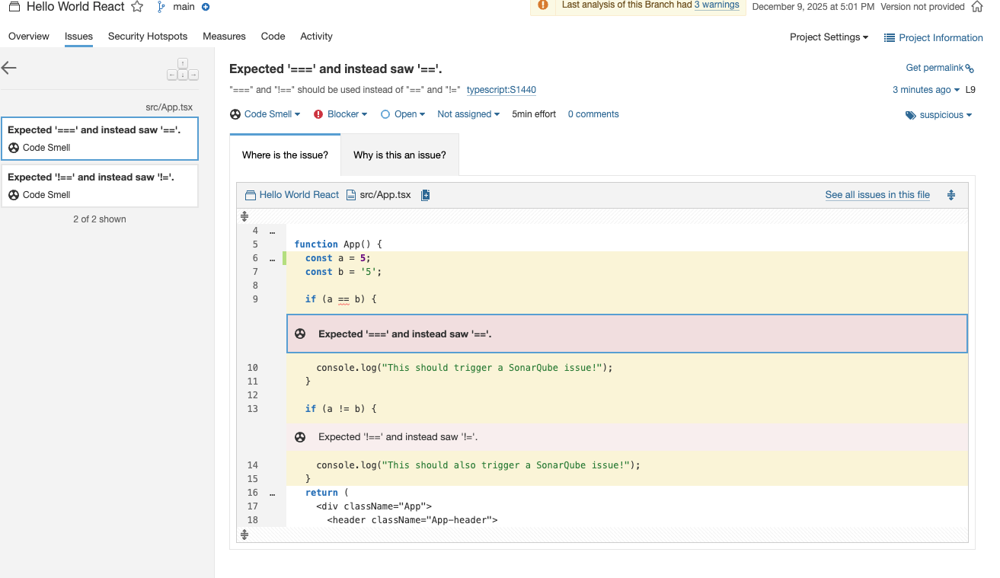

---


