# 🛠️ Analyser & Interpréter les Résultats du Scan – SonarQube (Dragon Project)

## 📊 Project Overview – SonarQube Dashboard

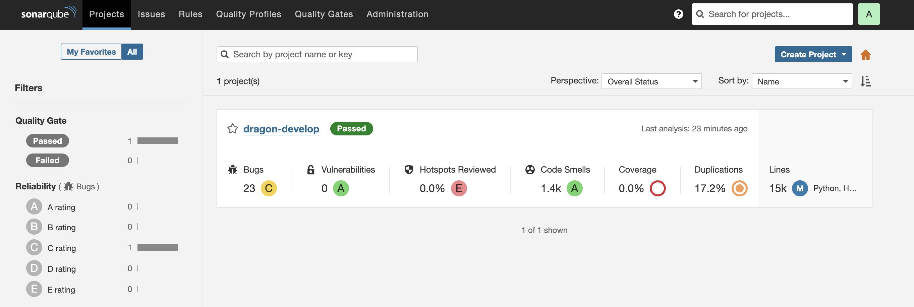

| Metric                         | Result                | Rating | Interpretation                         |
| ------------------------------ | --------------------- | ------ | -------------------------------------- |
| **Bugs**                       | 23                    | C      | Medium reliability risk                |
| **Vulnerabilities**            | 0                     | A      | No verified security flaws             |
| **Security Hotspots Reviewed** | 0%                    | E      | No security review done (critical)     |
| **Code Smells**                | 1.4k                  | A      | Maintainability issues but no blockers |
| **Coverage**                   | 0%                    | —      | No unit tests detected                 |
| **Duplications**               | 17.2%                 | —      | High code duplication                  |
| **Lines of Code**              | ~15k                  | —      | Project size                           |
| **Languages**                  | Python, HTML, JS, CSS | —      |                                        |

## 📘 SonarQube Quality Profile – What Rules Are Applied to the Dragon Project?
Every SonarQube analysis is driven by a Quality Profile.

A Quality Profile is essentially the **Rulebook** that tells SonarQube:

- which rules should be applied
- how strict the analysis should be
- which severities rules have
- which patterns are considered bugs, security issues, hotspots, or smells

Think of it as the **linting + security policy** that defines how your code is evaluated.


### 🔍 1. Which Quality Profile Was Applied to the Dragon Project?

For this scan, the project used the default SonarQube Built-in Quality Profiles:

| Language       | Quality Profile Applied                       |
| -------------- | --------------------------------------------- |
| **Python**     | Sonar way                                     |
| **JavaScript** | Sonar way                                     |
| **HTML**       | Sonar way (includes WCAG accessibility rules) |
| **CSS**        | Sonar way                                     |


These profiles include hundreds of rules:

| Language | Rule Set                                    | Purpose                                |
| -------- | ------------------------------------------- | -------------------------------------- |
| Python   | Python Sonar way                            | Bugs, security, maintainability        |
| HTML     | HTML Sonar way (WCAG + accessibility rules) | Accessibility, semantics, structure    |
| JS       | JavaScript Sonar way                        | Standard JS coding conventions         |
| CSS      | CSS Sonar way                               | Style cleanliness + dead rules cleanup |
 
> Each rule is categorized as Bug, Vulnerability, Security Hotspot, or Code Smell, and has a severity level (Blocker, Critical, Major, Minor, Info).
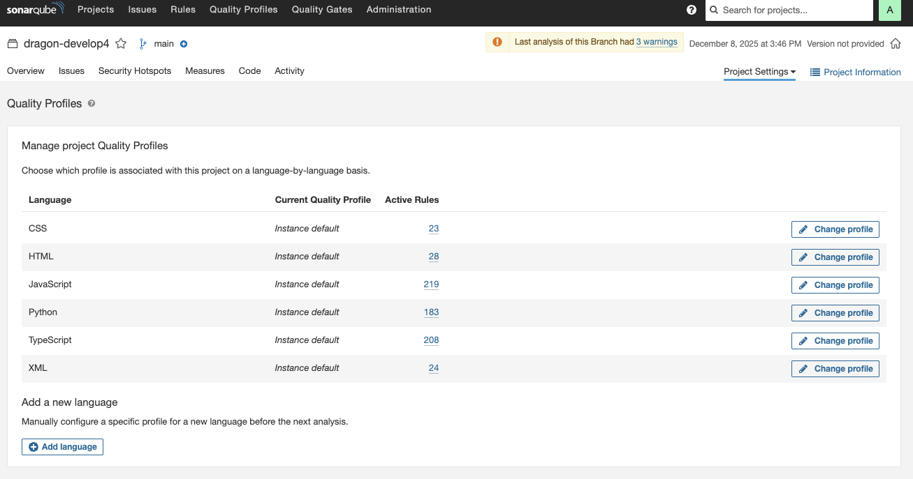

### 🧠 2. Why It Matters

The Quality Profile determines what SonarQube detects.

Example:

- HTML Minor issues → triggered by WCAG accessibility rules (missing lang, table captions, ARIA labels…)
- Python code smells → triggered by maintainability rules (complex functions, duplicated logic)
- Vulnerabilities → depend on the security rules enabled in the Python or JS profiles

Essentially, changing the profile changes the analysis results, so understanding which profile is applied is critical.

### 🔎 3. Example Rules Coming from the Quality Profile

#### HTML (Accessibility – WCAG AA)

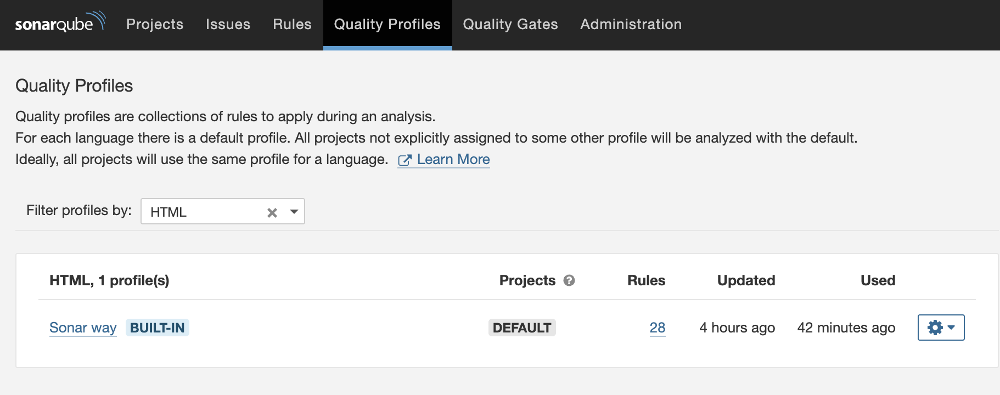

- ```bash <html> ``` must have a lang attribute
- ```bash <table> ``` must have a ```bash <caption> or <summary> ```
- ```bash  requires alt text ```
- Input labels must be associated with controls

→ These rules caused most of the Minor and Info issues.

#### Python (Maintainability + Security)
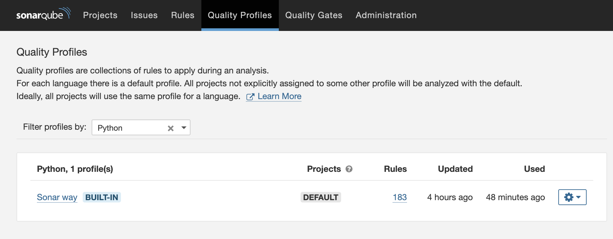

- Always-false conditions
- Conditional branches with same code
- Duplicate logic
- Hard-coded credentials (Security Hotspots)
- Complex functions too long or too nested
- Duplicated code blocks


→ These rules generated most Major code issues and  code smells.

### 4. Can You Change the Quality Profile?

Yes. SonarQube provides full control over rules and profiles.

| Action                     | Allowed? | Explanation                                                  |
| -------------------------- | -------- | ------------------------------------------------------------ |
| Assign a different profile | ✅ Yes    | You can assign a profile per language or per project         |
| Create a custom profile    | ✅ Yes    | Extend a built-in profile (“Sonar way”) and add/remove rules |
| Add new rules              | ✅ Yes    | Via plugins or custom regex-based rules                      |
| Disable rules              | ✅ Yes    | If they don’t apply to your project                          |
| Change severity of rules   | ⚠️ Yes   | Only for custom or non-SonarSource rules                     |

**Example custom profiles you could create:**

* **Python Security Extended** → extra security rules for Python
* **React Strict TS Rules** → stricter TypeScript rules for React components
* **WCAG AAA HTML Profile** → higher-level accessibility compliance for HTML

---

### 📝 5. How SonarQube Chooses the Profile for Each File

* **By Language**: SonarQube automatically applies the profile associated with the file’s language.
* **Per-Project Override**: You can assign specific profiles to your project instead of the default.
* **Per-File Override**: With **project-level settings or file path filters**, you can assign a different profile for specific files.

> This means you could have **Python files using “Sonar way”**, but specific critical modules could use **“Python Security Extended”**, and HTML templates could follow a stricter WCAG profile.


# ⭐ Understanding Severity Levels (Blocker → Info)
SonarQube assigns every issue a Severity.
Severity describes how serious the problem is and how urgent the fix should be.

There are 5 severity levels, from most important to least important:
# 🔥 1. Blocker — Must be fixed immediately

### Meaning:
A blocker issue represents a critical defect or security flaw that will break the application, cause data corruption, crashes, or expose a dangerous vulnerability.

### Examples:
- null pointer exceptions
- infinite loops
- SQL injection detected
- fatal configuration issues
***Action***: Fix now — project is not stable until resolved.

# 🚨 2. Critical — Fix as soon as possible
### Meaning:
High-risk issues that don’t break the system immediately but create major security or reliability risks.

### Examples:
- insecure authentication logic
- unsafe cryptography
- dangerous resource handling
- always-false conditions in security code
***Action***: Fix ASAP — next sprint at the latest.

# ⚠️ 3. Major — Fix soon (within sprint)

### Meaning:
Important maintainability or logic issues that make the code fragile, error-prone, or misleading.

### Examples:
- incorrect conditions
- dead code
- complex logic
- missing required HTML attributes
***Action***: Fix during normal development cycles.

# 🟡 4. Minor — Low priority improvements

### Meaning:
Small quality improvements that improve clarity but do not affect behavior.

### Examples:
- naming improvements
- optional refactors
- readability enhancements
***Action***: Fix when touching the file (boy-scout rule).

# 🔵 5. Info — Informational only

### Meaning:
Suggestions or optional improvements with no impact on correctness.

### Examples:
- optional comments
- best practice recommendations
***Action***: Optional.

# ✔ How This Applies to Dragon

From the scan:
| Severity | Bugs | Interpretation                 |
| -------- | ---- | ------------------------------ |
| Blocker  | 0    | No breaking issues 👍          |
| Critical | 0    | Good security state in bugs 👍 |
| Major    | 3    | Must be fixed (logic issues)   |
| Minor    | 20   | Mostly HTML accessibility      |
| Info     | 0–1  | Optional only                  |

### Interpretation

- No Critical or Blocker bugs → Good
- 3 Major bugs → Need attention (can break logic flow)
- 20 Minor bugs → Cosmetic, accessibility-related, mostly in HTML
- Majority of bugs come from HTML accessibility rules (WCAG)
    - <table> elements missing descriptions
    - <html> missing lang attribute

# 1. 🔍 How to Analyze & Interpret the Results

## 1.1 🐞 Bugs (23 – Rating C)

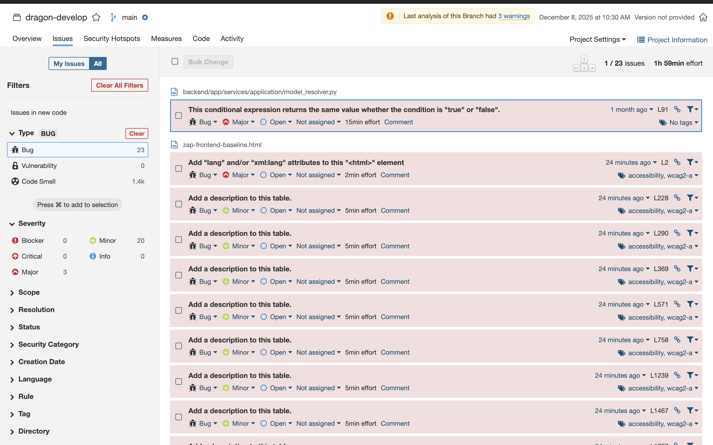

### ➤ What it means
Bugs represent coding errors that may cause:
- crashes
- incorrect outputs
- incorrect logic flow

**Rating C = acceptable but requires improvements.**

### 🧩 What to do
- Fix **Critical** and **Major** bugs first.
- Minor bugs → backlog.

### Example Bug (Real case from Dragon project)

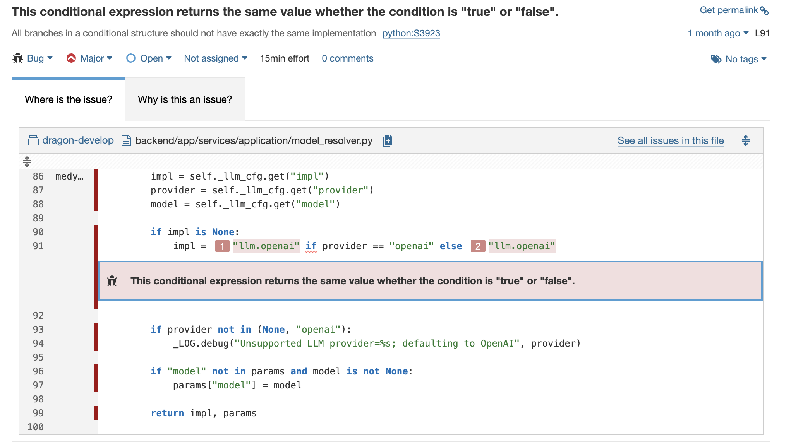

### Issue summary

Rule: python:S3923 – Conditional branches should not have the same implementation
File: backend/app/services/application/model_resolver.py
Severity: Major
Effort: 15min
Status: Open

### ❌ The Problematic Code
```bash
impl = self._llm_cfg.get("impl")
provider = self._llm_cfg.get("provider")
model = self._llm_cfg.get("model")
if impl is None:
    impl = "llm.openai" if provider == "openai" else "llm.openai"
# This always returns "llm.openai"
```

### ⚠ Why this is a Bug
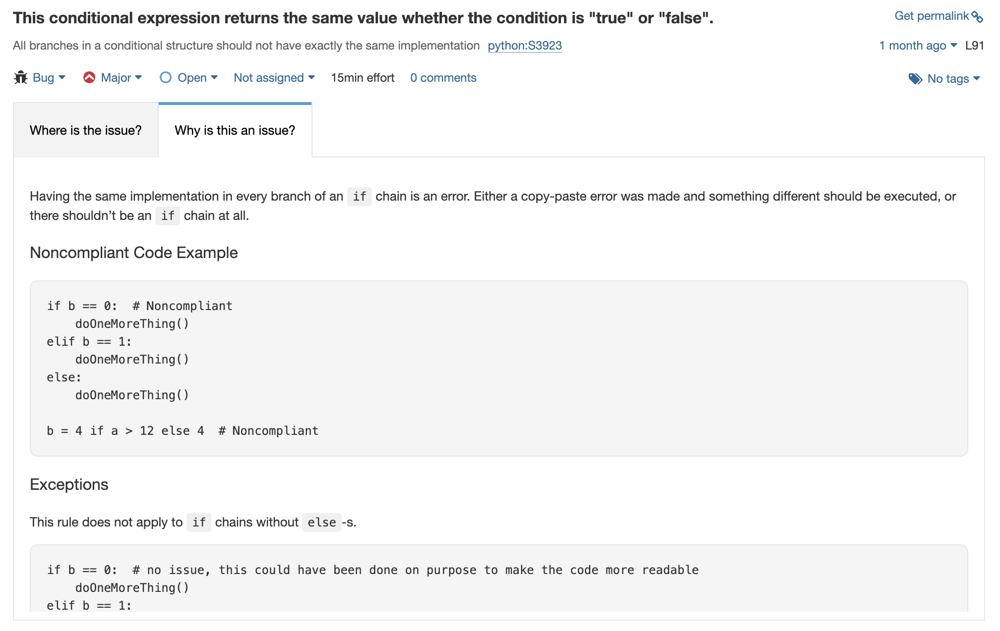

The conditional expression:

```bash
"llm.openai" if provider == "openai" else "llm.openai"
```

returns the same value in both branches, making the condition meaningless.

### ✔ How to Fix it

If a default is needed:

```bash
impl = impl or "llm.openai"
```

## 1.2 🛡️ Vulnerabilities (0 – Rating A)

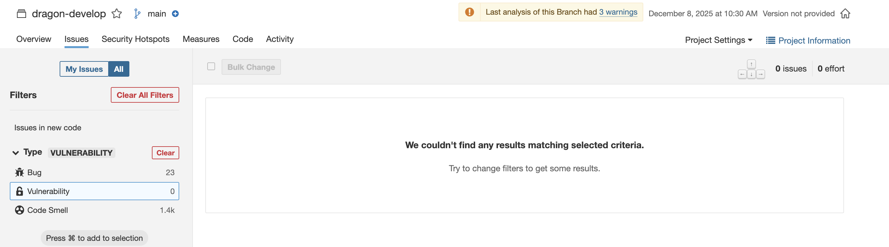

### 🔍 What it means
No confirmed vulnerabilities detected by SonarQube.

### 👍 Interpretation
Very good state.

⚠️ *But final security depends heavily on reviewing Security Hotspots.*

## 1.3 🚨 Security Hotspots (0% Reviewed – Rating E)

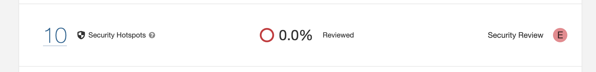

### 🔍 What it means
Hotspots = sensitive code patterns requiring **manual security review**.
Rating **E** = none were reviewed → **critical security risk**.

### ❗ Why it matters
Even without vulnerabilities, hotspots may hide:
- unsafe API usage
- insecure file operations
- unvalidated inputs
- unsafe Python/Javascript patterns

### 🧩 What to do
Review each hotspot and classify as:
- **Reviewed**
- **Fixed**
- **Safe**

### Example Security Hotspots (Real case from Dragon project)

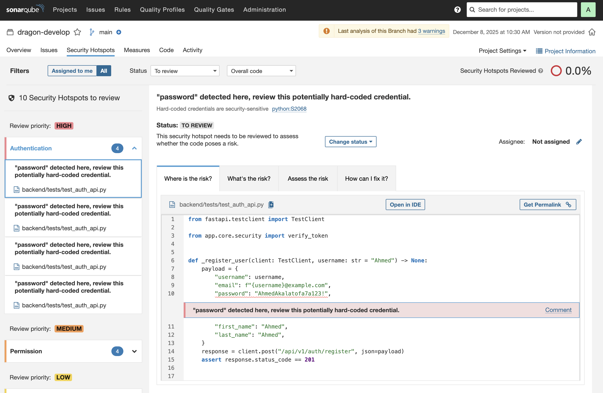

### 🔥 Example Hotspot

Rule: python:S2068
Risk: Hard-coded credentials detected
File: backend/tests/test_auth_api.py
Status: To review
Review Priority: High
Severity Type: Authentication

### 🔍 Where is the risk?

In the code:
```bash
payload = {
    "username": username,
    "email": f"{username}@example.com",
    "password": "AhmedAkalatofa7a123!",
}
```
SonarQube detects "password" + literal string → potential hard-coded credential.

Even if it's in tests, it must be reviewed.

### ⚠ Why is this a Hotspot?
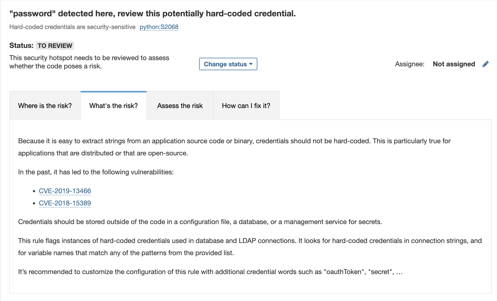

Hard-coded credentials can lead to:

- accidental leakage
- credential reuse by developers
- secrets ending in git history
- test code exposing sensitive data

Sonar does not assume it’s dangerous →
YOU must validate manually.


### ✔ How to assess the risk
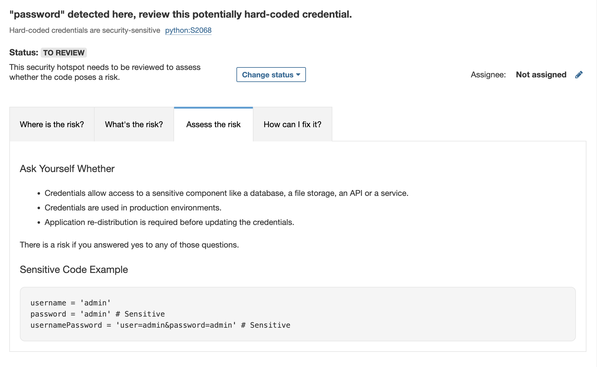

Do the following check:

- Is this credential used in production?
- Is the password recycled in configs?
- Is this OK because it’s fake test data?
- Does it expose any secrets outside test scope?

If safe → mark as Reviewed.

## ✔ How to fix
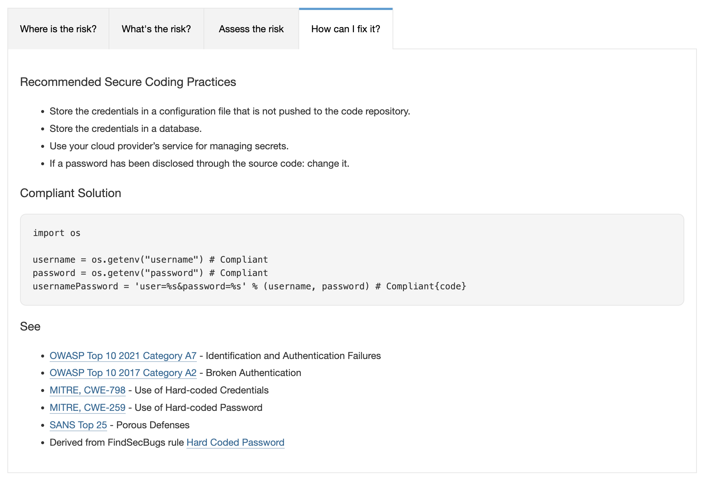

```bash

Replace by environment-based config:
    "password": os.getenv("TEST_USER_PASSWORD", "dummy-password"),
OR
    Use a factory/mocking system instead of explicit strings.
```

## 1.4 🧹 Code Smells (1.4k – Rating A)

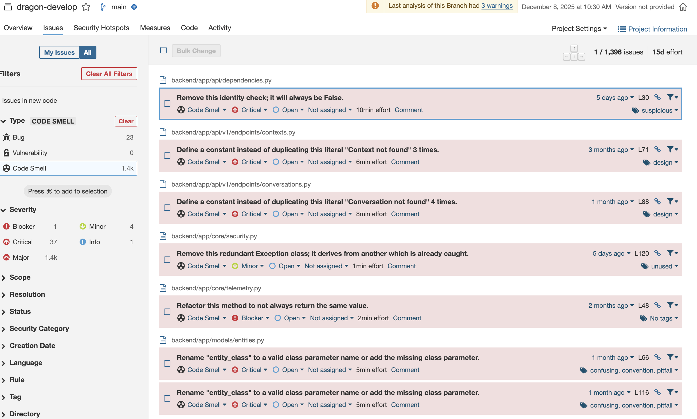

### 🔍 What it means
Maintainability issues such as:
- duplicated logic
- long functions
- complex conditions
- poor naming

Rating A = **Good maintainability**, but **1.4k smells** still require cleanup.

### 🧩 What to do
- Prioritize **Major** & **Critical** smells
- Minor smells → backlog refactoring

### Example Code Smell (Real case from Dragon project)
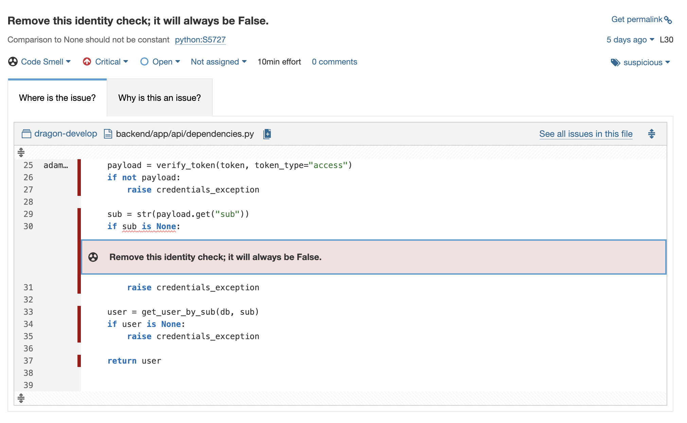

### 📝 Issue Summary

Rule: python:S5727
Title: Remove this identity check; it will always be False.
File: backend/app/api/dependencies.py
Severity: Critical
Effort: 10 min
Status: Open

### ❌ Problematic Code

```bash
    payload = verify_token(token, token_type="access")
    if not payload:
        raise credentials_exception
    sub = str(payload.get("sub"))

    if sub is None:
        # ❌ This condition will ALWAYS be False
        raise credentials_exception

    user = get_user_by_sub(db, sub)
    if user is None:
        raise credentials_exception
    return user
```

### 🔍 Where is the Issue?
This line is the problem:

```bash
if sub is None:
```

Because just before, we did:

```bash
sub = str(payload.get("sub"))
```

Converting a value to str() never returns None.
Even if payload.get("sub") is None → str(None) becomes:

```bash
"None"   # a string, not None
```
So the condition will never trigger.
Sonar flags this as:

    “Remove this identity check; it will always be False.”

### ⚠ Why is this an Issue?

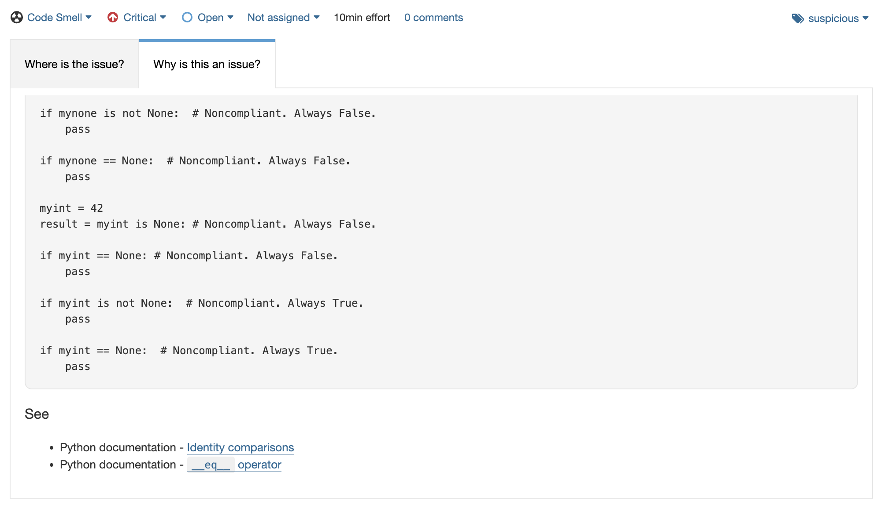


## 1.5 🧪 Coverage – 0%
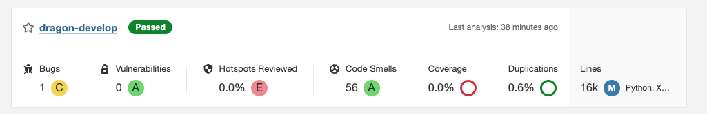
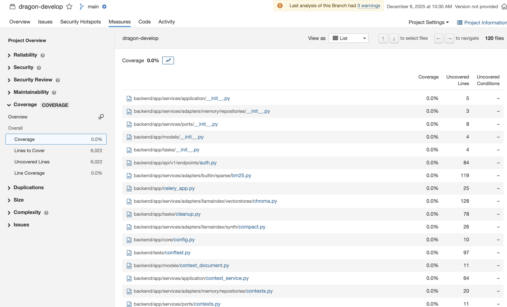

### 🔍 What it means
Coverage shows how much of your source code is executed by automated tests.
SonarQube does not run tests itself — it only reads coverage reports generated by external tools (pytest, Jest, etc.).

### ❗ Why Coverage Was 0% (Even With Unit Tests)

When the first scan was executed with:
```bash
docker run --rm --network host -v "$(pwd):/usr/src" sonarsource/sonar-scanner-cli \
  -Dsonar.projectKey=dragon-develop5 \
  -Dsonar.sources=. \
  -Dsonar.host.url=http://localhost:9000
```
SonarQube detected:
- No coverage report
- No test execution results

Therefore:
📉 Coverage = 0%
This is expected behavior because SonarQube only interprets an existing XML report — it does not generate one.

###  2. Step 1 — Generate Coverage Report Using Pytest

```bash
cd backend
poetry run pytest --cov=. --cov-report=xml:coverage.xml
```

This generates:
```bash
backend/coverage.xml
```
SonarQube needs this XML file to calculate coverage.

### 3. Step 2 — Fix Coverage Paths When Scanning From Docker

When scanning via Docker, the project is mounted under:
```bash
/usr/src
```
But the generated coverage.xml contained local filesystem paths such as:

```bash
/Users/you/dragon/backend/app
```
Since these paths do not exist inside the container, SonarQube could not match them to your code → coverage ignored.
Manual Fix Applied

The <source> paths inside coverage.xml were updated to match Docker’s mounted directory:

<source>/usr/src/backend</source>
<source>/usr/src/backend/app</source>
This ensures SonarQube can correctly map the coverage data to scanned files.

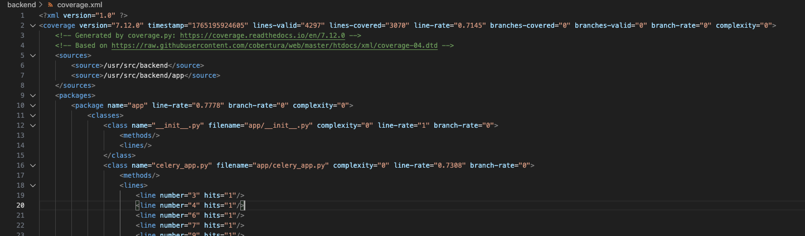

### 4. Step 3 — Run SonarQube Scan With the Coverage Report Enabled

The scan command was updated to include the coverage path:
```bash
-Dsonar.python.coverage.reportPaths=backend/coverage.xml
```
new working scan command:

docker run --rm --network host -v "$(pwd):/usr/src" sonarsource/sonar-scanner-cli \
  -Dsonar.projectKey=dragon-develop5 \
  -Dsonar.projectName=dragon-develop5 \
  -Dsonar.sources=. \
  -Dsonar.host.url=http://localhost:9000 \
  -Dsonar.login=admin \
  -Dsonar.password=@dmin \
  -Dsonar.python.version=3 \
  -Dsonar.python.coverage.reportPaths=backend/coverage.xml

📈 5. Result After Integrating Coverage Properly

After fixing the paths and re-running the scan:

- Coverage is correctly detected
- Test execution is visible inside SonarQube
- Dashboard now reflects real coverage percentages


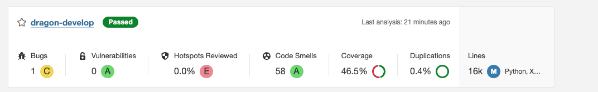
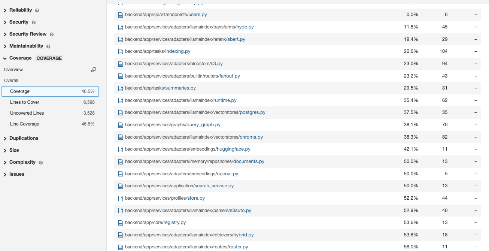


## 1.6 🔁 Code Duplications – 17.2%

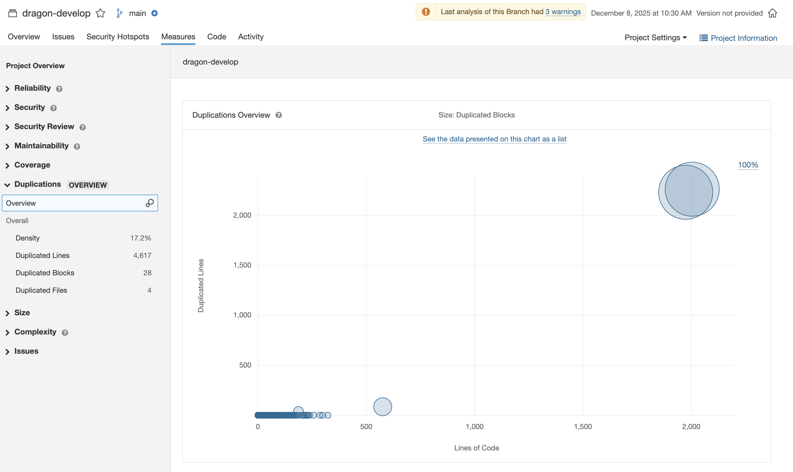

### 🔍 What it means

Code duplication occurs when identical or very similar blocks of code appear multiple times across the project.
High duplication increases maintenance effort and the risk of introducing bugs when changes are made.

### 📊 Key Metrics

| Metric                | Value | Explanation                                                |
| --------------------- | ----- | ---------------------------------------------------------- |
| **Density**           | 17.2% |The percentage of your total code that is duplicated        | 
| **Duplicated Lines**  | 4,617 |Total number of lines that are duplicated across the project|
| **Duplicated Blocks** | 28    |A block is a chunk of consecutive duplicated lines          |
| **Duplicated Files**  | 4     |Number of files that contain duplicated code                |

### ❗ Impact

* Higher risk of bugs due to repeated logic
* Harder to maintain and refactor
* Violates clean coding principles and DRY (Don’t Repeat Yourself) rules

### 🧩 Recommended Actions

* Refactor repeated code into **shared modules** or **utility functions**
* Create **reusable components** for duplicated logic
* Consolidate similar code blocks to improve maintainability
* Monitor duplication density after each major refactor


# 2. 🎯 Sonar Ratings Explained (A → E)


| Rating | Meaning    | Interpretation                |
| ------ | ---------- | ----------------------------- |
| **A**  | Excellent  | No significant issues         |
| **B**  | Good       | Minor improvements needed     |
| **C**  | Acceptable | Moderate issues               |
| **D**  | Poor       | Requires urgent fixes         |
| **E**  | Critical   | Severe issues – must be fixed |

# 3. 🧠 Apply to the Dragon Project

| Category        | Rating | Meaning                   |
| --------------- | ------ | ------------------------- |
| Vulnerabilities | **A**  | Secure                    |
| Code Smells     | **A**  | Maintainable              |
| Bugs            | **C**  | Needs improvements        |
| Hotspot Review  | **E**  | ⚠️ Critical security risk |

# 4. 📉 Technical Debt

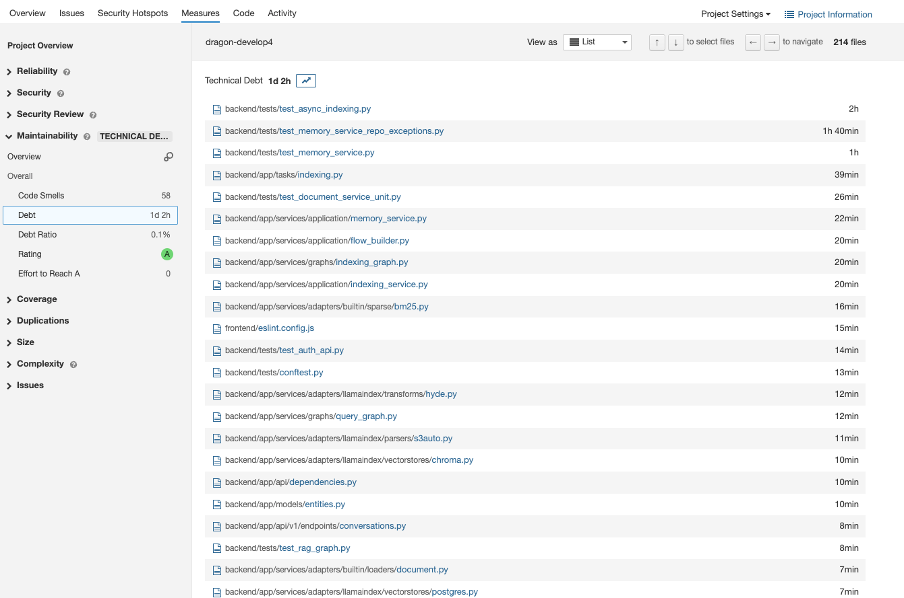

Sonar estimates the required time to fix maintainability issues.

### ✏️ Interpretation
- High number of code smells → higher technical debt
- Rating A → the ratio is still acceptable

### 🧩 What to do
- Reduce duplication
- Fix complex code
- Simplify long functions and nested conditions

# 5. 🧭 Priority Action Plan

## 🔥 High Priority (Fix immediately)
- Review **ALL Security Hotspots** (Rating E)
- Add **unit tests** (0% coverage)
- Fix **critical & major bugs**
- Reduce **critical duplicated blocks**

## 🟡 Medium Priority
- Refactor files with many code smells
- Simplify complex methods

## 🟢 Low Priority
- UI / formatting improvements
- Minor code smells
