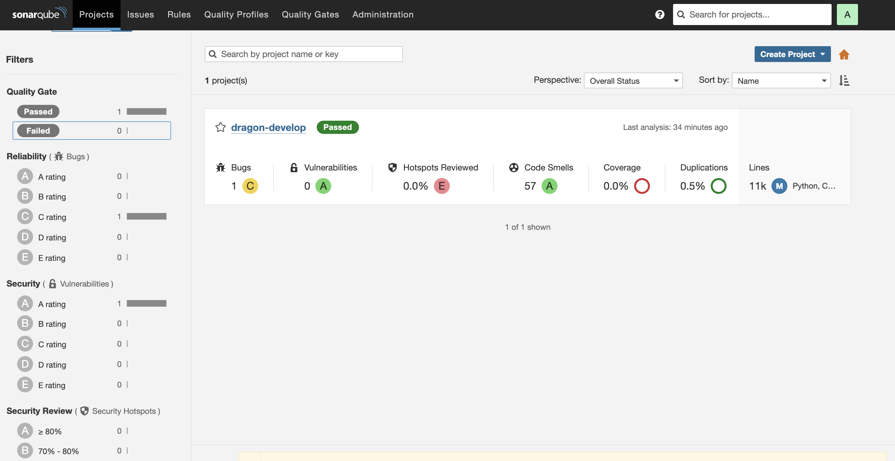

# SonarQube - Setup & Quick Scan
**Purpose:** Analyze code quality, technical debt, and security (SAST) using SonarQube.

---

## 🚀 Quick Scan Procedure

### 1. Clone repository and checkout branch
```bash
git clone https://github.com/keiken-digital-solution/keiken-dragon-ai.git
cd keiken-dragon-ai  && git checkout develop
```
### 2. Start SonarQube server
```bash
docker run -d --name sonarqube -p 9000:9000 sonarqube:lts-community
```
### 3. Run Sonar Scanner
```bash
docker run --rm --network host -v "$(pwd):/usr/src" sonarsource/sonar-scanner-cli \
  -Dsonar.projectKey=dragon-develop \
  -Dsonar.projectName=dragon-develop \
  -Dsonar.sources=. \
  -Dsonar.host.url=http://localhost:9000 \
  -Dsonar.login=admin \
  -Dsonar.password=admin \
  -Dsonar.python.version=3
```
### 4. Open Dashboard
```bash
open http://localhost:9000/dashboard?id=dragon-develop
```


